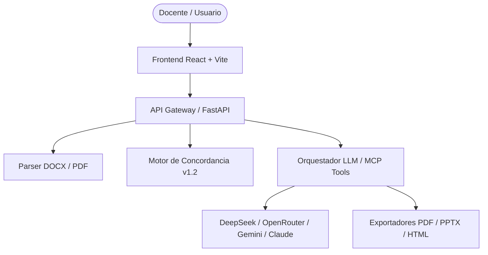

# 🎓 Plataforma Pedagógica UEI — Motor de Análisis Curricular y Generación de Recursos

[](https://www.python.org/)
[](https://fastapi.tiangolo.com/)
[](https://reactjs.org/)
[](https://vitejs.dev/)
[](https://tailwindcss.com/)
[](LICENSE)

Sistema integral de gestión instruccional desarrollado para la **Unidad Educativa Bilingüe Indoamérica**. Permite validar la correspondencia curricular semana a semana entre la microplanificación (sílabo) y el material de estudio (guía didáctica), detectando vacíos pedagógicos y generando automáticamente recursos didácticos interactivos listos para **Canvas LMS**, **PDF para impresión** y **presentaciones PPTX**.

---

## 📌 Tabla de Contenidos

- [Características Principales](#-características-principales)
- [Módulos del Sistema](#-módulos-del-sistema)
- [Arquitectura y Tecnologías](#-arquitectura-y-tecnologías)
- [Requisitos Previos](#-requisitos-previos)
- [Instalación y Configuración](#-instalación-y-configuración)
- [Variables de Entorno](#-variables-de-entorno)
- [Despliegue con Docker](#-despliegue-con-docker)
- [Ejecución de Pruebas](#-ejecución-de-pruebas)
- [Servidor MCP Standalone](#-servidor-mcp-standalone)
- [Estructura del Proyecto](#-estructura-del-proyecto)
- [Créditos e Institución](#-créditos-e-institución)

---

## 🔥 Características Principales

- 📋 **Validación Curricular v1.2**: Análisis automático de correspondencia entre el sílabo en Word (`.docx`) y la guía didáctica en PDF (`.pdf`), verificando la trazabilidad de semanas, subtemas atómicos y códigos de competencias.
- 🏷️ **Sello Pedagógico de Veredicto**: Evaluación sintética global (`CUMPLE`, `CUMPLE PARCIAL`, `NO CUMPLE`) con matriz expandible semana a semana.
- ⚡ **Generación Didáctica con IA (MCP Tool-Calling)**: Orquestación estricta que impide al modelo generar marcado no confiable; la IA selecciona el contenido pedagógico y las herramientas validadas generan la interfaz HTML/CSS/JS autónoma.
- 🎨 **Compatibilidad nativa con Canvas LMS**: Creación de tareas formateadas con encabezado institucional, rúbricas de evaluación y tarjetas interactivas listas para copiar e insertar en el editor HTML de Canvas.
- 🎮 **Recursos Gamificados**: Generación instantánea de crucigramas, sopas de letras, tarjetas 3D giratorias (flashcards), rompecabezas de lógica y mapas conceptuales SVG.
- 🔒 **Protección de Datos / Anonimización**: Seudonimización automática de identificadores de estudiantes en adaptaciones curriculares antes de consultar a los modelos de IA.
- 🧹 **Gestión Efímera de Sesiones**: Sistema sin base de datos pesada: las ejecuciones viven en carpetas temporales seguras con un motor de limpieza automática en segundo plano.

---

## 🧩 Módulos del Sistema

### 1. 📋 Validador de Contenidos Curriculares
Permite subir la microplanificación y la guía didáctica. Extrae la estructura de ambas partes, evalúa el nivel de cobertura de subtemas y genera un **Reporte en PDF** oficial de correspondencia curricular. Permite la generación de recursos para semanas habilitadas (con opción de advertencia pedagógica para semanas con observaciones).

### 2. ⚡ Generador de Contenidos Didácticos
- **Conversor de PDF a Material Interactivo**: Convierte libros y folletos en PDF a lecciones navegables HTML5 con autoguardado de notas y zona de dibujo.
- **Generador de Tareas Canvas**: Diseñador visual de tareas estructuradas con plantillas rápidas (Talleres Prácticos, Proyectos Integradores, Informes de Lectura) y guía paso a paso para Canvas LMS.

### 3. 🎮 Generador de Actividades Lúdicas
Diseñado para la creación directa de recursos interactivos autónomos (crucigramas, sopas de letras, rompecabezas de ordenamiento y emparejamiento, flashcards 3D) descargables tanto en formato interactivo como en **PDF imprimible**.

---

## 🛠️ Arquitectura y Tecnologías



### Backend
- **Framework**: Python 3.12+, [FastAPI](https://fastapi.tiangolo.com/), Pydantic v2.
- **Procesamiento de Documentos**: `python-docx`, `pdfplumber`, `reportlab`, `python-pptx`.
- **Orquestación IA**: Soporte multimodelo ([DeepSeek API](https://www.deepseek.com/), [OpenRouter](https://openrouter.ai/), [Google Gemini](https://ai.google.dev/), [Anthropic Claude](https://www.anthropic.com/)).

### Frontend
- **Framework**: React 18, TypeScript, Vite.
- **Estilos**: TailwindCSS v3 (Vanilla CSS utility system con paleta de color institucional).
- **Iconos & Componentes**: Lucide React / Componentes tipados a medida.

---

## 💻 Requisitos Previos

Asegúrate de contar con los siguientes elementos instalados en tu sistema:

- **Node.js**: v20.0.0 o superior ([Descargar Node.js](https://nodejs.org/))
- **Python**: v3.12.0 o superior ([Descargar Python](https://www.python.org/))
- **Git**: v2.40+ ([Descargar Git](https://git-scm.com/))
- **Clave API de IA**: Al menos una API Key de DeepSeek, OpenRouter, Google Gemini o Anthropic para habilitar las funciones de generación.

---

## 🚀 Instalación y Configuración

### 1. Clonar el repositorio

```bash
git clone https://github.com/tu-usuario/Unidad-Educativa.git
cd Unidad-Educativa
```

### 2. Configurar el Backend (API)

```bash
cd Generador_Contenido/apps/api

# Crear y activar entorno virtual
python -m venv .venv

# En Windows (PowerShell):
./.venv/Scripts/Activate.ps1

# En Linux/macOS:
source .venv/bin/activate

# Instalar dependencias
pip install -r requirements.txt

# Configurar variables de entorno
cp .env.example .env   # Edita .env con tus claves de API
```

Para iniciar el servidor del backend en modo desarrollo:

```bash
uvicorn app.main:app --reload --port 8000
```
La API estará disponible en `http://localhost:8000` (Documentación Swagger interactiva en `http://localhost:8000/docs`).

### 3. Configurar el Frontend (Web)

Abre otra terminal y ejecuta:

```bash
cd Generador_Contenido/apps/web

# Instalar paquetes
npm install

# Iniciar servidor de desarrollo
npm run dev
```
La interfaz web estará disponible en `http://localhost:5173`. El servidor Vite redirige automáticamente las solicitudes `/api/*` hacia `http://localhost:8000`.

---

## 🔑 Variables de Entorno

Crea un archivo `.env` dentro de `Generador_Contenido/apps/api/` con la siguiente estructura:

```ini
# Proveedor principal de IA ("deepseek", "openrouter", "gemini" o "anthropic")
LLM_PROVIDER=deepseek

# Claves de API (Configura al menos una de las siguientes)
DEEPSEEK_API_KEY=sk-...
OPENROUTER_API_KEY=sk-or-v1-...
GEMINI_API_KEY=AIzaSy...
ANTHROPIC_API_KEY=sk-ant-...

# Configuración del servidor
WORK_DIR=var/sessions
SESSION_TTL_SECONDS=86400
```

---

## 🐳 Despliegue con Docker

El proyecto incluye una configuración lista para entornos de producción mediante Docker Compose.

```bash
cd Generador_Contenido/infra

# Copiar variables de entorno
cp .env.example .env   # Completa tus claves de API

# Construir y levantar contenedores
docker compose up --build -d
```

- **Aplicación Web**: `http://localhost:8080`
- **API Backend**: `http://localhost:8000`

---

## 🧪 Ejecución de Pruebas

El sistema cuenta con una suite completa de **44 pruebas unitarias e integrales** que verifican el funcionamiento de los parsers de Word/PDF, las reglas de concordancia v1.2, la generación de PDFs y las herramientas MCP.

```bash
cd Generador_Contenido/apps/api
python -m pytest tests/ -v
```

---

## 🔌 Servidor MCP Standalone

Las herramientas de generación didáctica (`build_interactive_activity`, `render_diagram`, `build_crossword`, etc.) se encuentran expuestas como un servidor independiente del **Model Context Protocol (MCP)**, reutilizable desde **Claude Desktop** o cualquier cliente compatible:

```bash
cd Generador_Contenido/apps/api
python -m app.mcp_server.server
```

---

## 📁 Estructura del Proyecto

```text
Unidad-Educativa/
├── README.md                     # Documentación principal para la portada de GitHub
└── Generador_Contenido/
    ├── apps/
    │   ├── api/                  # Backend FastAPI
    │   │   ├── app/
    │   │   │   ├── core/        # Configuración y manejo de sesiones efímeras
    │   │   │   ├── mcp_server/  # Servidor MCP y herramientas didácticas
    │   │   │   ├── routers/     # Endpoints de API (documentos, generación, exportación)
    │   │   │   ├── schemas/     # Modelos de datos Pydantic
    │   │   │   └── services/    # Parsers (DOCX, PDF), motor de concordancia y exportadores
    │   │   ├── tests/           # Pruebas unitarias (Pytest)
    │   │   └── requirements.txt
    │   └── web/                  # Frontend React + TypeScript
    │       ├── src/
    │       │   ├── components/  # Componentes UI (Validador, Generador, Actividades)
    │       │   ├── lib/         # Cliente API e interfaces TypeScript
    │       │   └── App.tsx
    │       └── package.json
    └── infra/                    # Configuración Docker & Docker Compose
```

---

## 🏛️ Créditos e Institución

Desarrollado para la **Unidad Educativa Bilingüe Indoamérica**.  
© 2026 Todos los derechos reservados.
